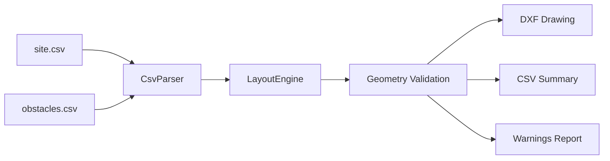

# SiteSketch

SiteSketch is a C++ engineering layout automation tool that converts CSV-defined site and equipment specifications into 2D layouts, validates spacing and boundary constraints, and exports AutoCAD-compatible DXF drawings and Excel-ready CSV reports.

## What It Does

SiteSketch reads engineering layout constraints from CSV files and generates a simple 2D site layout. It places rectangular equipment inside a site boundary, respects setback and spacing rules, avoids obstacles, and reports layout capacity and validation warnings.

## Why It Matters

Engineering teams often move site dimensions, equipment schedules, setback rules, and access constraints between spreadsheets and CAD drawings by hand. SiteSketch demonstrates a small automation workflow that turns those spreadsheet-style inputs into deterministic layout drawings and reports while keeping the codebase portable and easy to understand.

## Architecture



The reusable `sitesketch_core` library contains parsing, geometry, layout, DXF, and report logic. The `sitesketch` executable handles command-line parsing and orchestration.

## Demo Output

```text
SiteSketch layout generation complete.

Panels placed: 762
Estimated capacity: 419.1 kW
Rows used: 14
Obstacles avoided: 3
Warnings: 0

DXF written to: output/layout.dxf
CSV report written to: output/summary.csv
Warnings written to: output/warnings.txt
```

Generated files:

- `output/layout.dxf`: AutoCAD-compatible 2D line drawing.
- `output/summary.csv`: Excel-ready metrics report.
- `output/warnings.txt`: Non-fatal layout and input warnings.

## Tech Stack

- C++17
- CMake
- Standard Library only
- CSV input
- Plain text DXF output

## Features

- Reads site, panel, spacing, setback, and obstacle definitions from CSV files.
- Places rectangular equipment in a deterministic grid while respecting setbacks and spacing.
- Avoids rectangular obstacles such as transformer pads, access roads, and restricted areas.
- Validates geometry for containment, rectangle overlap, usable area, malformed CSV rows, and obstacle issues.
- Exports a minimal AutoCAD-compatible DXF drawing with site, panel, obstacle, access, restricted, and text layers.
- Writes an Excel-ready summary CSV and a plain text warnings report.
- Includes assert-based CTest coverage for geometry, CSV parsing, layout generation, DXF output, and reports.

## Example Input

`data/site.csv`

```csv
site_width_m,site_height_m,setback_m,panel_width_m,panel_height_m,panel_watts,row_spacing_m,col_spacing_m
80,50,2,1.1,2.2,550,0.6,0.2
```

`data/obstacles.csv`

```csv
id,x_m,y_m,width_m,height_m,type
transformer_pad,20,15,5,4,equipment
access_road,0,25,80,3,access
restricted_area,55,10,8,12,restricted
```

## Example Command

```bash
./sitesketch \
  --site data/site.csv \
  --obstacles data/obstacles.csv \
  --out output/layout.dxf \
  --report output/summary.csv \
  --warnings output/warnings.txt
```

## Project Structure

```text
SiteSketch/
  CMakeLists.txt
  data/
    site.csv
    obstacles.csv
  include/
    CsvParser.h
    DxfWriter.h
    Geometry.h
    LayoutEngine.h
    ReportWriter.h
    Site.h
    Warning.h
  src/
    CsvParser.cpp
    DxfWriter.cpp
    Geometry.cpp
    LayoutEngine.cpp
    ReportWriter.cpp
    Site.cpp
    main.cpp
  tests/
    test_csv_parser.cpp
    test_dxf_writer.cpp
    test_geometry.cpp
    test_layout_engine.cpp
    test_report_writer.cpp
```

## Build

```bash
cmake -S . -B build
cmake --build build
```

Run the executable:

```bash
./build/sitesketch \
  --site data/site.csv \
  --obstacles data/obstacles.csv \
  --out output/layout.dxf \
  --report output/summary.csv \
  --warnings output/warnings.txt
```

If no obstacle file is needed, omit `--obstacles`.

## Test

```bash
ctest --test-dir build
```

## Future Improvements

- Add support for rotated objects.
- Add multiple equipment types.
- Add a Python/Jupyter visualization notebook.
- Add optimization strategies for maximizing capacity.
- Add JSON input support.
- Add a simple GUI.
